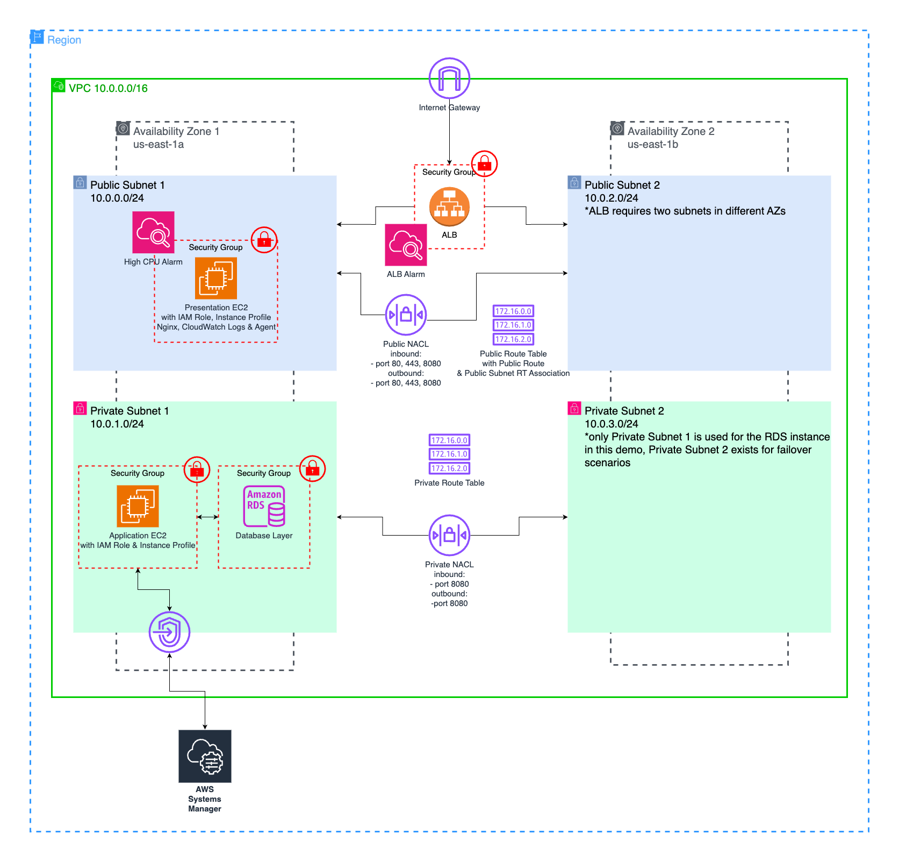

# **🚀 Deploying & Securing a 3-Tier Architecture with AWS CloudFormation**

_A hands-on AWS CloudFormation project designed to build a secure, scalable, and resilient 3-tier cloud architecture._




<br>

## Table of Contents
- [Project Overview](#project-overview)
- [Architecture Components](#architecture-components)
- [Repository Structure](#repository-structure)
- [Key Takeaways from This Project](#key-takeaways-from-this-project)
- [Future Enhancements](#future-enhancements)
- [How to Deploy](#how-to-deploy)
- [Connect and Learn More](#connect-and-learn-more)

<br>

## Project Overview

This CloudFormation template automates the deployment of a **secure 3-tier architecture** in AWS, with an emphasis on **security best practices** and **scalability**.

Problem Statement
Deploying a secure, scalable web application manually is time-consuming and prone to security misconfigurations.

Business Impact
✅ Reduces infrastructure costs by provisioning only what’s needed.
✅ Increases security by enforcing best practices (e.g., private subnets, IAM roles).
✅ Simplifies scaling by using Load Balancers & Auto Scaling groups.

How Companies Use This
Startups & enterprises automate cloud deployment to onboard applications quickly without manual work.
    

_Note: The project is designed for educational purposes. It is not yet production-ready (e.g., lacks ACM support for full HTTPS)._

<br>

## Architecture Components

*   **Networking**: VPC, subnets, security groups, Network ACLs.
    
*   **Compute**: EC2 instances for the application and database tiers.
    
*   **Database**: Amazon RDS (private subnet), using Secrets Manager for credentials.
    
*   **Load Balancing**: Application Load Balancer (ALB) for distributing traffic.
    
*   **Security**: IAM roles, security groups, CloudWatch monitoring.

<br>

## Repository Structure

*   README.md – This file
    
*   [cloudformation-template.yaml](https://github.com/joeycloudio/aws-cloudformation-3-tier-security/blob/main/3-tier-security-demo.yml) – CloudFormation template for deploying resources

<br>    

## Key Takeaways from This Project

*   Hands-on experience deploying a 3-tier architecture with AWS CloudFormation.
    
*   Strengthened understanding of **VPCs, IAM roles, security best practices**.
    
*   Learned how to debug **CloudFormation templates** and resolve issues.
    
*   Gained insights into using **CloudWatch** for system monitoring.

<br> 

## Future Enhancements

*   Implement **ACM for HTTPS support** to ensure secure connections.
    
*   Add **Auto Scaling** to scale resources based on demand.
    
*   Enhance **monitoring and logging** with CloudTrail and AWS Config.

<br>

## How to Deploy

1.  Clone the repository:
    ```bash
    git clone https://github.com/yourusername/aws-cloudformation-3-tier-security.git
    ```
2. Navigate to the project directory:
    ```bash
    cd aws-cloudformation-3-tier-security
    ```
3.  Go to the AWS CloudFormation console.
    
4.  Upload cloudformation-template.yaml.
    
5.  Launch the stack and review created resources.

<br>    

## Connect and Learn More

*   Email: joeyacostax@gmail.com

*   LinkedIn Article: [Full Project Breakdown](https://www.linkedin.com/pulse/deploying-securing-3-tier-architectures-aws-joey-acosta-aom3c/?trackingId=yon6XSOLRPWgLY%2FvZ3ChgQ%3D%3D)
    
*   [Portfolio & Other AWS Projects](https://learn.nextwork.org/portfolio)
